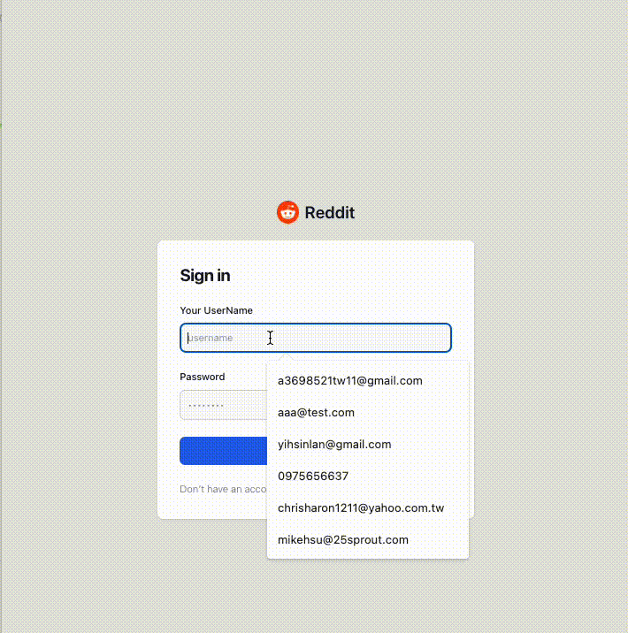

# go-kit-reddit-demo

## Demo



## 專案講解


此專案以 `Golang` 做為後端語言並使用 `go-kit` 框架以及 `React` 做為前端，試圖建立出 Reddit 般的足以承受高併發高流量的分散式系統，其核心為發表貼文、回覆以及對貼文或回覆的點讚功能(目前僅完成發表貼文功能)。

專案架構以`Clean Architecture` 為核心實踐 SOLID 原則和參考 `Standard Golang Project Layout` ，期望實現高內聚低耦合，易讀易擴充的程式品質。

```yaml
├── cmd
│   ├── auth
│   │   ├── main.go
│   │   └── service
│   ├── post
│   │   ├── main.go
│   │   └── service
│   ├── reddit
│   │   ├── main.go
│   │   └── service
│   └── user
│       ├── main.go
│       └── service
├── configs
│   └── config.yaml
├── deployments
│   ├── docker
│   │   ├── auth
│   │   ├── post
│   │   ├── reddit
│   │   ├── user
│   │   └── web
│   └── kube
├── docker-compose.yml
├── go.mod
├── go.sum
├── internal
│   ├── auth
│   │   ├── client
│   │   ├── endpoint
│   │   ├── service
│   │   └── transport
│   ├── pkg
│   │   ├── config
│   │   ├── jwt
│   │   ├── logger
│   │   └── pg
│   ├── post
│   │   ├── client
│   │   ├── endpoint
│   │   ├── entity
│   │   ├── repository
│   │   ├── service
│   │   └── transport
│   ├── reddit
│   │   ├── endpoint
│   │   ├── service
│   │   └── transport
│   └── user
│       ├── client
│       ├── endpoint
│       ├── entity
│       ├── repository
│       ├── service
│       └── transport
├── makefile
├── migrations
│   ├── post
│   │   ├── 000001_create_posts_table.down.sql
│   │   └── 000001_create_posts_table.up.sql
│   └── user
│       ├── 000001_create_users_table.down.sql
│       └── 000001_create_users_table.up.sql
└── web
    ├── index.html
    ├── nginx
    │   └── nginx.conf
    ├── node_modules
    ├── package-lock.json
    ├── package.json
    ├── public
    │   └── vite.svg
    ├── src
    ├── tailwind.config.cjs
    ├── vite.config.js
    └── yarn.lock
```

### 使用環境及工具

- 前端：React + Vite (Tailwind)
- 後端：Golang(Go-Kit)

### **如何運行該專案(使用docker-compose)**

```
# 透過 git clone 專案到主機任意路徑下
git clone https://github.com/MikeHsu0618/go-kit-reddit-demo.git
```

運行專案：

```
# 在本專案的根目錄下執行以下指令即可
cp go-kit-reddit-demo
docker compose up -d

# 以瀏覽器打開 http://localhost:80 即可顯示前端頁面
```

### Restful API (Back-end)

- starts a server on localhost port 8381 (by default).
- [http://localhost:8381](http://localhost:8381)

| Method | Path | Usage |
| --- | --- | --- |
| GET | /list-post | 取得文章列表 |
| POST | /create-post | 成立訂單 |
| POST | /login | 登入並取得 JWT |
| POST | /register | 註冊用戶 |

### Todo

- [ ]  Deploy to Kubernetes
- [ ]  Setup Istio
- [ ]  Import DTM
- [ ]  Implement Comment Service
- [ ]  Implement Rating Service
